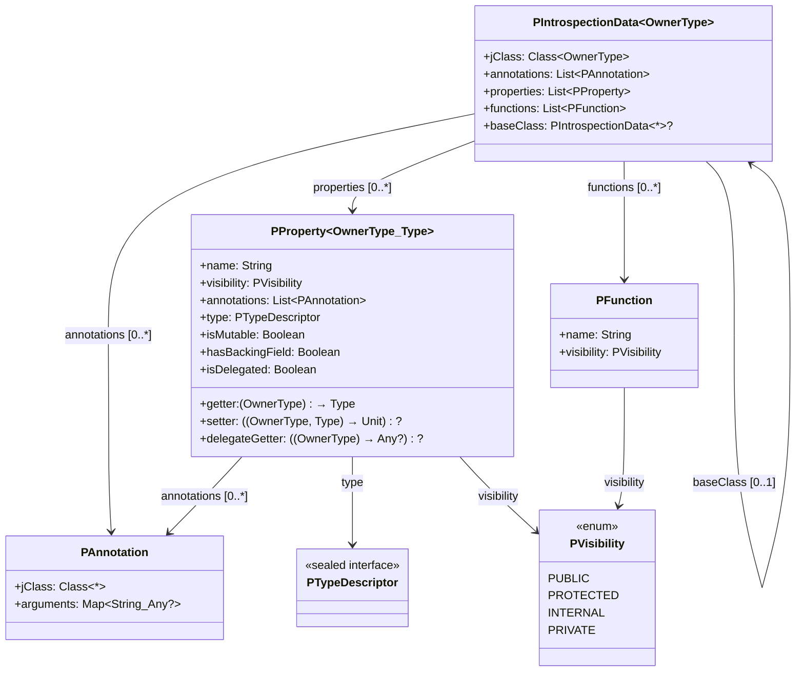
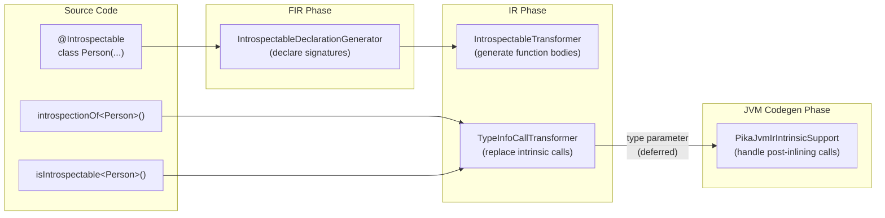
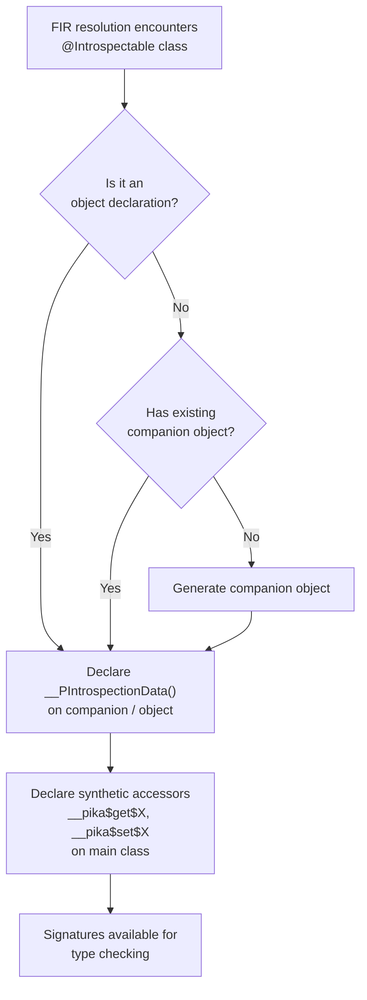
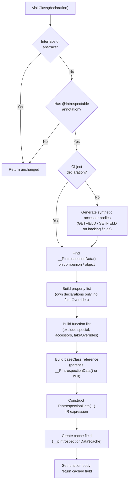
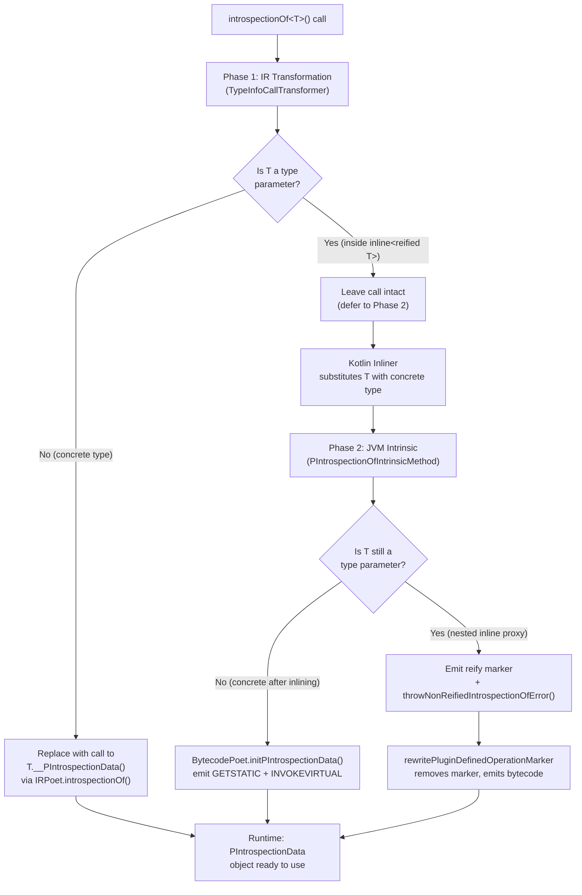
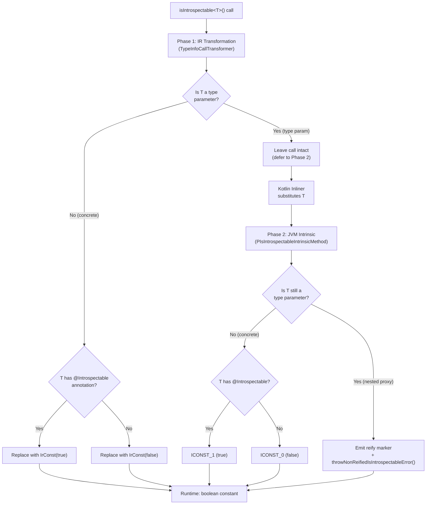
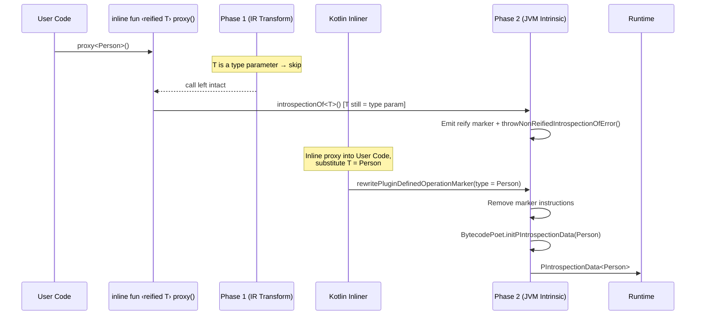
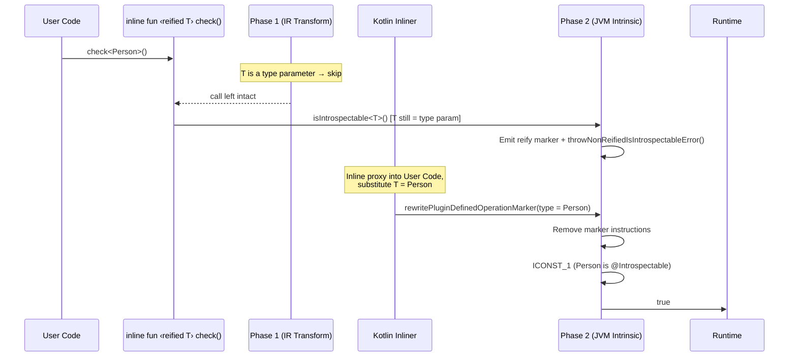

The Pika compiler plugin provides a compile-time introspection system built on three primitives:

- **`@Introspectable`** -- a marker annotation. Classes annotated with it get a synthetic
  `__PIntrospectionData()` function generated by the compiler plugin, containing property
  metadata, function metadata, annotations, and getter/setter lambdas.
- **`introspectionOf<T>()`** -- a compiler-intrinsic function that returns `PIntrospectionData<T>`
  for any `@Introspectable` type `T`. The function body never executes -- the plugin replaces
  every call with a direct invocation of `T.__PIntrospectionData()`.
- **`isIntrospectable<T>()`** -- a compiler-intrinsic function that returns a constant `true` or
  `false` at compile time, depending on whether `T` is annotated with `@Introspectable`.

Together these give you full runtime access to class structure -- properties, functions, annotations,
getters, setters, and inheritance chains -- with zero reflection overhead.

---

## The `PIntrospectionData` Hierarchy

`introspectionOf<T>()` returns a `PIntrospectionData<T>` object. This is the root of a small
hierarchy that describes a class:



| Class | Purpose |
|---|---|
| `PIntrospectionData<T>` | Root descriptor for an `@Introspectable` class. Holds the Java class reference, annotations, properties, functions, and an optional link to the parent class's introspection data. |
| `PProperty<OwnerType, Type>` | Descriptor for a single property. Includes getter/setter lambdas, visibility, mutability, annotations, a `PTypeDescriptor` for the property type, and delegation info. |
| `PFunction` | Descriptor for a declared function. Currently exposes name and visibility. |
| `PAnnotation` | Descriptor for an annotation instance. Holds the annotation's Java class and a map of argument names to values (primitives, strings, enums, `Class`). |
| `PVisibility` | Enum: `PUBLIC`, `PROTECTED`, `INTERNAL`, `PRIVATE`. |

---

## Examples

### Basic usage

Annotate a class with `@Introspectable` and use `introspectionOf<T>()` to get its metadata:

```kotlin
@Introspectable
class Person(val name: String, var age: Int)

val data = introspectionOf<Person>()
data.jClass                          // Person::class.java
data.properties.size                 // 2
data.properties.map { it.name }      // ["name", "age"]
```

### Checking with `isIntrospectable<T>()`

`isIntrospectable<T>()` is replaced at compile time with a constant boolean:

```kotlin
@Introspectable
class Person(val name: String)

class Plain(val x: Int) // not @Introspectable

isIntrospectable<Person>()  // true  (compile-time constant)
isIntrospectable<Plain>()   // false (compile-time constant)
isIntrospectable<String>()  // false
```

This is useful for generic code that needs to branch on whether a type has introspection data:

```kotlin
inline fun <reified T> describeIfPossible(): String {
  if (!isIntrospectable<T>()) return "No introspection data for ${T::class.simpleName}"
  val data = introspectionOf<T>()
  return "${data.jClass.simpleName}: ${data.properties.map { it.name }}"
}

describeIfPossible<Person>() // "Person: [name, age]"
describeIfPossible<String>() // "No introspection data for String"
```

### Property access -- getters and setters

Each `PProperty` carries a `getter` lambda and an optional `setter` lambda:

```kotlin
@Introspectable
class Person(val name: String, var age: Int)

val data = introspectionOf<Person>()
val person = Person("Alice", 30)

val nameProp = data.properties.find { it.name == "name" }!!
nameProp.getter(person)     // "Alice"
nameProp.isMutable          // false (val)
nameProp.hasBackingField    // true
nameProp.setter             // null (val has no setter)

val ageProp = data.properties.find { it.name == "age" }!!
ageProp.getter(person)      // 30
ageProp.isMutable           // true (var)

@Suppress("UNCHECKED_CAST")
val ageSetter = ageProp.setter as (Person, Int) -> Unit
ageSetter(person, 31)
person.age                  // 31
```

### Class annotations

Annotations on the class itself are available via `data.annotations`:

```kotlin
@Target(AnnotationTarget.CLASS)
annotation class MyAnnotation(val value: String)

@Introspectable
@MyAnnotation("example")
class Annotated(val x: Int)

val data = introspectionOf<Annotated>()
data.annotations.size                                    // 2 (@Introspectable + @MyAnnotation)

val myAnno = data.annotations.find { it.jClass == MyAnnotation::class.java }!!
myAnno.arguments["value"]                                // "example"
```

### Property annotations

Each property also carries its own annotation list:

```kotlin
@Target(AnnotationTarget.PROPERTY)
annotation class Label(val text: String)

@Introspectable
class Form(
  @Label("Full name")
  val name: String
)

val data = introspectionOf<Form>()
val nameProp = data.properties.find { it.name == "name" }!!
val label = nameProp.annotations.find { it.jClass == Label::class.java }!!
label.arguments["text"] // "Full name"
```

### Inheritance

Each `@Introspectable` class only lists its **own** declared properties and functions (no inherited
members). The `baseClass` field links to the parent's `PIntrospectionData`, forming a chain:

```kotlin
@Introspectable
open class Animal(val species: String)

@Introspectable
class Dog(species: String, val breed: String) : Animal(species)

val dogData = introspectionOf<Dog>()
dogData.properties.size               // 1 (only "breed")
dogData.properties[0].name            // "breed"

val animalData = dogData.baseClass!!
animalData.jClass                     // Animal::class.java
animalData.properties.size            // 1 (only "species")
animalData.properties[0].name         // "species"

// Access inherited property via baseClass getter
@Suppress("UNCHECKED_CAST")
val speciesGetter = animalData.properties[0].getter as (Any) -> String
speciesGetter(Dog("Canine", "Labrador")) // "Canine"
```

If the parent is **not** `@Introspectable`, `baseClass` is `null`:

```kotlin
open class PlainParent(val x: Int) // not @Introspectable

@Introspectable
class Child(val y: Int) : PlainParent(0)

introspectionOf<Child>().baseClass // null
```

### Object declarations

`@Introspectable` works on Kotlin `object` declarations. The `__PIntrospectionData()` function
is generated directly on the object (no companion needed):

```kotlin
@Introspectable
object Config {
  val version: String = "1.0"
}

val data = Config.__PIntrospectionData()
data.jClass                         // Config::class.java
data.properties[0].name             // "version"
data.properties[0].getter(Config)   // "1.0"
```

### Functions

Functions declared directly on the class are available via `data.functions`:

```kotlin
@Introspectable
class Calculator {
  val value: Int = 0
  fun add(a: Int, b: Int): Int = a + b
  private fun multiply(a: Int, b: Int): Int = a * b
  internal fun subtract(a: Int, b: Int): Int = a - b
}

val data = introspectionOf<Calculator>()
data.functions.map { it.name }                  // ["add", "multiply", "subtract"]
data.functions.find { it.name == "add" }!!.visibility        // PVisibility.PUBLIC
data.functions.find { it.name == "multiply" }!!.visibility   // PVisibility.PRIVATE
data.functions.find { it.name == "subtract" }!!.visibility   // PVisibility.INTERNAL
```

### Custom introspectable annotations

You can register additional annotations that should be treated as `@Introspectable` via the Gradle DSL:

```kotlin
// build.gradle.kts
pika {
  introspectableAnnotation("com.example.MyRecord")
}
```

Then any class annotated with `@MyRecord` is processed exactly like `@Introspectable`:

```kotlin
package com.example

annotation class MyRecord

@MyRecord
class Person(val name: String)

// All of these work:
isIntrospectable<Person>()            // true
val data = introspectionOf<Person>()  // PIntrospectionData<Person>
val data2 = Person.__PIntrospectionData() // same result
```

### Inline reified proxy functions

Both `introspectionOf<T>()` and `isIntrospectable<T>()` work through `inline fun <reified T>`
call chains. The plugin rewires the type at each inlined call site:

```kotlin
inline fun <reified T> describe() = introspectionOf<T>()
inline fun <reified T> check() = isIntrospectable<T>()

describe<Person>().jClass // Person::class.java
check<Person>()           // true
check<String>()           // false
```

Nested proxies are also supported:

```kotlin
inline fun <reified T> proxy1() = introspectionOf<T>()
inline fun <reified T> proxy2() = proxy1<T>()

proxy2<Person>().jClass // Person::class.java -- works through two levels of inlining
```

Calling with a **non-reified** type parameter throws at runtime:

```kotlin
fun <T> broken() = introspectionOf<T>() // throws UnsupportedOperationException:
// "introspectionOf<T>() requires a reified type parameter.
//  Use 'inline fun <reified T>' or call introspectionOf<T>() with a concrete type."
```

### Caching

Introspection data is constructed once and cached. Repeated calls return the **same instance**
(identity equality):

```kotlin
@Introspectable
class Person(val name: String)

val a = introspectionOf<Person>()
val b = introspectionOf<Person>()
val c = Person.__PIntrospectionData()

a === b // true -- same cached instance
a === c // true -- introspectionOf and __PIntrospectionData share the cache
```

The cache also applies to `baseClass` references in inheritance chains:

```kotlin
@Introspectable
open class Parent(val a: Int)

@Introspectable
class Child(val b: Int) : Parent(0)

val parentData = introspectionOf<Parent>()
val childData = introspectionOf<Child>()

childData.baseClass === parentData // true -- same cached Parent instance
```

---

## Compilation Stage Examples

The following examples show how `@Introspectable`, `introspectionOf<T>()`, and `isIntrospectable<T>()`
transform through each compilation stage. All excerpts are trimmed from actual compiler output.

### `@Introspectable` class declaration

**Source:**

```kotlin
@Introspectable
class Person(val name: String)
```

**FIR** -- the `IntrospectableDeclarationGenerator` adds synthetic **signatures** (no bodies yet).
The companion object, `__PIntrospectionData()`, and the synthetic accessors are all visible to
the type checker:

```
@R|io/github/lukmccall/pika/Introspectable|() public final class Person : R|kotlin/Any| {
    public final val name: R|kotlin/String|
        public get(): R|kotlin/String|

    // Synthetic accessor signatures -- generated by the plugin
    internal final fun __pika$get$name(): R|kotlin/String|
    internal final fun __pika$set$name(value: R|kotlin/String|): R|kotlin/Unit|

    // Generated companion with introspection function signature
    public final companion object Companion : R|kotlin/Any| {
        public final fun __PIntrospectionData():
            R|io/github/lukmccall/pika/PIntrospectionData<test/Person>|
    }
}
```

**IR** -- the `IntrospectableTransformer` fills in the function bodies. Three key parts:

**(a) Synthetic accessor bodies** -- direct field access, bypassing Kotlin visibility:

```
FUN GENERATED name:__pika$get$name visibility:internal returnType:kotlin.String
  BLOCK_BODY
    RETURN
      GET_FIELD 'name' type=kotlin.String
        receiver: GET_VAR '<this>: Person'

FUN GENERATED name:__pika$set$name visibility:internal returnType:kotlin.Unit
  VALUE_PARAMETER name:value type:kotlin.String
  BLOCK_BODY
    SET_FIELD 'name' type=kotlin.Unit
      receiver: GET_VAR '<this>: Person'
      value: GET_VAR 'value: kotlin.String'
```

**(b) Cache field** -- the `PIntrospectionData` object is constructed once at class load time:

```
FIELD name:__pIntrospectionData$cache type:PIntrospectionData<Person> [final]
  EXPRESSION_BODY
    CONSTRUCTOR_CALL 'PIntrospectionData.<init>'
      ARG jClass: CLASS_REFERENCE name:Person
      ARG annotations: CALL 'listOf'
        ARG elements: VARARG
          CONSTRUCTOR_CALL 'PAnnotation.<init>'
            ARG jClass: CLASS_REFERENCE name:Introspectable
            ARG arguments: CALL 'emptyMap'
      ARG properties: CALL 'listOf'
        ARG elements: VARARG
          CONSTRUCTOR_CALL 'PProperty.<init>'
            ARG name: CONST String value="name"
            ARG visibility: GET_ENUM 'PUBLIC'
            ARG annotations: CALL 'listOf' (empty)
            ARG type: CONSTRUCTOR_CALL 'PTypeDescriptor.Concrete.<init>'
              ARG pType: CONSTRUCTOR_CALL 'PType.<init>'
                ARG jClass: CLASS_REFERENCE name:String
              ARG isNullable: CONST Boolean value=false
              ARG introspection: CONST Null value=null
            ARG getter: FUN_EXPR (lambda)
              // { owner -> owner.__pika$get$name() }
            ARG isMutable: CONST Boolean value=false
            ARG hasBackingField: CONST Boolean value=true
            ARG setter: FUN_EXPR (lambda)
              // { owner, value -> owner.__pika$set$name(value) }
            ARG isDelegated: CONST Boolean value=false
            ARG delegateGetter: CONST Null value=null
      ARG functions: CALL 'listOf' (...)
      ARG baseClass: CONST Null value=null
```

**(c) `__PIntrospectionData()` body** -- returns the cached field:

```
FUN GENERATED name:__PIntrospectionData returnType:PIntrospectionData<Person>
  BLOCK_BODY
    RETURN
      GET_FIELD '__pIntrospectionData$cache'
        receiver: GET_VAR '<this>: Person.Companion'
```

### `introspectionOf<Person>()` call replacement

**Source:**

```kotlin
val data = introspectionOf<Person>()
```

**FIR** -- the call is preserved. The plugin does not touch it during FIR resolution:

```
lval data: R|io/github/lukmccall/pika/PIntrospectionData<test/Person>| =
    R|io/github/lukmccall/pika/introspectionOf|<R|test/Person|>()
```

**IR** -- Phase 1 replaces the call with a direct invocation of `__PIntrospectionData()` on the
companion object:

```
VAR name:data type:PIntrospectionData<Person> [val]
  CALL '__PIntrospectionData()' declared in Person.Companion
    ARG <this>: GET_OBJECT 'Companion'
```

**Bytecode** -- Phase 2 emits two instructions:

```
GETSTATIC  Person.Companion : LPerson$Companion;
INVOKEVIRTUAL  Person$Companion.__PIntrospectionData ()LPIntrospectionData;
```

### `isIntrospectable<T>()` constant folding

**Source:**

```kotlin
@Introspectable
class Foo(val x: Int)

class Bar(val x: Int)  // not @Introspectable

isIntrospectable<Foo>()  // true
isIntrospectable<Bar>()  // false
```

**FIR** -- both calls are preserved as function calls:

```
R|io/github/lukmccall/pika/isIntrospectable|<R|test/Foo|>()
R|io/github/lukmccall/pika/isIntrospectable|<R|test/Bar|>()
```

**IR** -- Phase 1 replaces both calls with boolean constants. The function calls are completely
eliminated:

```
CONST Boolean type=kotlin.Boolean value=true     // isIntrospectable<Foo>()
CONST Boolean type=kotlin.Boolean value=false    // isIntrospectable<Bar>()
```

**Bytecode** -- a single constant instruction each:

```
ICONST_1    // isIntrospectable<Foo>() → true
ICONST_0    // isIntrospectable<Bar>() → false
```

---

## Generated Code -- What `@Introspectable` Produces

For the actual FIR and IR representations of the generated code, see the Compilation Stage
Examples above.

When the compiler plugin processes an `@Introspectable` class, it generates several synthetic
declarations. For a class like:

```kotlin
@Introspectable
class Person(val name: String, var age: Int)
```

The plugin generates the equivalent of:

```kotlin
class Person(val name: String, var age: Int) {
  // --- Synthetic accessors (generated on the main class) ---
  // These bypass visibility restrictions to access backing fields directly.

  @JvmSynthetic
  internal fun `__pika$get$name`(): String = this.name   // reads backing field

  @JvmSynthetic
  internal fun `__pika$set$name`(value: String) { this.name = value }

  @JvmSynthetic
  internal fun `__pika$get$age`(): Int = this.age

  @JvmSynthetic
  internal fun `__pika$set$age`(value: Int) { this.age = value }

  // --- Companion object (generated if none exists) ---
  companion object {
    // Cache field -- initialized once, reused on subsequent calls
    private val `__pIntrospectionData$cache`: PIntrospectionData<Person> =
      PIntrospectionData(
        jClass = Person::class.java,
        annotations = listOf(PAnnotation(Introspectable::class.java, emptyMap())),
        properties = listOf(
          PProperty(
            name = "name",
            visibility = PVisibility.PUBLIC,
            annotations = emptyList(),
            type = typeDescriptorOf<String>(),        // PTypeDescriptor for the property type
            getter = { owner -> owner.`__pika$get$name`() },
            isMutable = false,                        // val
            hasBackingField = true,
            setter = null,                            // val has no setter
            isDelegated = false,
            delegateGetter = null
          ),
          PProperty(
            name = "age",
            visibility = PVisibility.PUBLIC,
            annotations = emptyList(),
            type = typeDescriptorOf<Int>(),
            getter = { owner -> owner.`__pika$get$age`() },
            isMutable = true,                         // var
            hasBackingField = true,
            setter = { owner, value -> owner.`__pika$set$age`(value) },
            isDelegated = false,
            delegateGetter = null
          )
        ),
        functions = emptyList(),
        baseClass = null
      )

    fun __PIntrospectionData(): PIntrospectionData<Person> = `__pIntrospectionData$cache`
  }
}
```

Key implementation details:

- **Synthetic accessors** (`__pika$get$X`, `__pika$set$X`) are generated on the main class to
  bypass Kotlin visibility rules and access backing fields directly. The backing field's `isFinal`
  flag is cleared so the synthetic setter can write to `val` backing fields from outside `<init>`.
- **Companion object** is generated if the class doesn't already have one. If a companion exists,
  the plugin adds `__PIntrospectionData()` to it.
- **Cache field** (`__pIntrospectionData$cache`) is a private final field on the companion,
  initialized with the `PIntrospectionData` object. The `__PIntrospectionData()` function simply
  returns this field.
- **Object declarations** skip the companion entirely -- `__PIntrospectionData()` and the cache
  field are generated directly on the object.

---

## Compilation Pipeline

The Pika compiler plugin processes introspection in **three distinct paths** that cooperate
across the FIR and IR compilation phases:



### Path 1: `@Introspectable` Code Generation

This is the most complex path. It runs in two compiler phases:

#### FIR Phase: `IntrospectableDeclarationGenerator`

During FIR (Frontend IR) resolution, the declaration generator **declares** synthetic members
so they are visible to the type checker. No implementation is generated yet -- just signatures.



What gets declared:

| Target | Generated declaration |
|---|---|
| Regular class (no companion) | New companion object + `__PIntrospectionData()` function + synthetic accessors |
| Regular class (has companion) | `__PIntrospectionData()` on existing companion + synthetic accessors |
| Object declaration | `__PIntrospectionData()` directly on the object |
| Interface / abstract class | **Nothing** -- skipped |

Synthetic accessors are declared for every property with a backing field:
- `internal fun __pika$get$<name>(): <Type>` -- getter
- `internal fun __pika$set$<name>(value: <Type>)` -- setter

#### IR Phase: `IntrospectableTransformer`

During IR generation, the transformer fills in the function bodies that were declared in FIR:



### Path 2: `introspectionOf<T>()` Replacement

The plugin processes `introspectionOf<T>()` calls in **two phases**, following the same pattern
as `typeDescriptorOf<T>()`. This two-phase design is necessary because Kotlin's IR generation
runs _before_ inline functions are inlined.



#### Phase 1: IR Transformation

**Class**: `TypeInfoCallTransformer`

When the transformer encounters a call to `introspectionOf<T>()`:

1. **Extracts the type argument** `T` from the call expression.
2. **If `T` is a concrete type** (e.g. `Person`): replaces the call with `IRPoet.introspectionOf()`,
   which builds an IR call to the companion's (or object's) `__PIntrospectionData()` function.
3. **If `T` is a type parameter** (inside `inline fun <reified T>`): skips. The call remains
   as-is, and Phase 2 handles it after inlining.

#### Phase 2: JVM Intrinsic

**Class**: `PIntrospectionOfIntrinsicMethod` (inner class of `PikaJvmIrIntrinsicSupport`)

After inline functions have been inlined, this phase handles remaining calls:

1. **If `T` is now a concrete type**: calls `BytecodePoet.initPIntrospectionData()` to emit
   bytecode that loads the companion/object instance and invokes `__PIntrospectionData()`.
2. **If `T` is still a type parameter** (nested inline proxy): emits a **reify marker** for
   the Kotlin inliner to process on the next pass.
3. **For non-introspectable types**: pushes `null` onto the stack (the call produces `null`
   at runtime instead of throwing).

### Path 3: `isIntrospectable<T>()` Replacement

`isIntrospectable<T>()` follows the same two-phase pattern, but the output is simpler -- a
boolean constant instead of a method call.



#### Phase 1: IR Transformation

`IRPoet.isIntrospectable(type)` checks whether the type's `IrClass` has the `@Introspectable`
annotation (or any registered custom annotation) and emits an `IrConst<Boolean>`:

```kotlin
fun isIntrospectable(type: IrType): IrExpression {
    val simpleType = type as? IrSimpleType
        ?: return kotlin.bool(false)
    val irClass = simpleType.classOrNull?.owner
        ?: return kotlin.bool(false)
    return kotlin.bool(irClass.hasIntrospectableAnnotation(extraAnnotationClassIds))
}
```

#### Phase 2: JVM Intrinsic

`PIsIntrospectableIntrinsicMethod` emits `ICONST_1` or `ICONST_0` directly. For type parameters
still unresolved after inlining, it emits a reify marker.

---

## IR Code Generation Algorithm

### Property discovery

`IntrospectableTransformer` collects properties declared directly on the class:

```kotlin
val properties = irClass.declarations
    .filterIsInstance<IrProperty>()
    .filter { !it.isFakeOverride }   // own declarations only
```

For each property, `IRPoet.pProperty()` generates an IR expression that constructs a `PProperty`
with:
- `name` -- the property name
- `visibility` -- mapped from the IR visibility descriptor
- `annotations` -- each annotation's constructor call is converted to a `PAnnotation` with an
  arguments map (primitives, strings, enums, and `Class<*>` values)
- `type` -- a `PTypeDescriptor` for the property's type (uses the same mechanism as `typeDescriptorOf`)
- `getter` -- a lambda that calls the synthetic accessor `__pika$get$<name>()` on the receiver
- `setter` -- a lambda that calls `__pika$set$<name>()`, or `null` if no backing field
- `isMutable`, `hasBackingField`, `isDelegated`, `delegateGetter` -- flags and accessors

### Function discovery

Functions are filtered to exclude special declarations:

```kotlin
val functions = irClass.declarations
    .filterIsInstance<IrSimpleFunction>()
    .filter { func ->
        !func.name.isSpecial &&
        !func.isFakeOverride &&
        func.correspondingPropertySymbol == null &&   // not a property accessor
        func.name.asString() != "__PIntrospectionData" &&
        func.name.asString() != "<init>" &&
        !func.name.asString().startsWith(Identifiers.PIKA_SPECIAL_PREFIX)
    }
```

### Base class reference

The transformer walks the class's `superTypes` to find the first non-`Any`, non-interface parent.
If that parent has `@Introspectable`, a call to the parent companion's `__PIntrospectionData()`
is emitted as the `baseClass` value. Otherwise `baseClass` is `null`.

### Cache construction

The `PIntrospectionData` expression is stored in a private final field on the companion (or
object). The `__PIntrospectionData()` function body simply returns this field:

```kotlin
val cacheField = createIntrospectionDataCacheField(
    owner = companionOrObject,
    type = introspectionData.type,
    initializer = introspectionData  // computed once at class load time
)
function.body = /* return cacheField */
```

---

## Bytecode Generation (Phase 2)

When `introspectionOf<T>()` or `isIntrospectable<T>()` are processed during JVM codegen
(Phase 2), the plugin emits bytecode directly.

### `introspectionOf<Person>()` (regular class)

```
GETSTATIC  Person.Companion : LPerson$Companion;
INVOKEVIRTUAL  Person$Companion.__PIntrospectionData ()Lio/github/lukmccall/pika/PIntrospectionData;
```

This loads the companion object singleton, then calls `__PIntrospectionData()` which returns
the cached `PIntrospectionData<Person>` instance.

### `introspectionOf<Config>()` (object declaration)

```
GETSTATIC  Config.INSTANCE : LConfig;
INVOKEVIRTUAL  Config.__PIntrospectionData ()Lio/github/lukmccall/pika/PIntrospectionData;
```

For objects, the `INSTANCE` field is loaded directly.

### `introspectionOf<Plain>()` (non-introspectable type)

```
ACONST_NULL
```

For types without `@Introspectable`, `null` is pushed onto the stack. The runtime cast will
produce `null` rather than throwing.

### `isIntrospectable<Person>()` (@Introspectable)

```
ICONST_1
```

A single constant `true` instruction -- zero overhead.

### `isIntrospectable<String>()` (not @Introspectable)

```
ICONST_0
```

A single constant `false` instruction.

---

## The Reify Marker Mechanism

When `introspectionOf<T>()` or `isIntrospectable<T>()` is called inside a reified inline
function, the type `T` is not yet known. The plugin uses a **reify marker** -- a special
bytecode pattern that the Kotlin inliner understands -- to defer type resolution.

### `introspectionOf<T>()` through a reified proxy



### `isIntrospectable<T>()` through a reified proxy



### Reify marker structure

The reify marker consists of three bytecode instructions:

1. **Reified operation marker**: `ReifiedTypeInliner.putReifiedOperationMarkerIfNeeded()` --
   tells the Kotlin inliner "this instruction depends on a type parameter."
2. **Throw call**: `INVOKESTATIC throwNonReified...Error()` -- a safety net. If the inliner
   fails to process the marker (e.g. the function was called without inlining), this throws
   `UnsupportedOperationException` with a descriptive message.
3. **Plugin marker string**: An `LDC` instruction with the fully qualified function name
   (e.g. `io.github.lukmccall.pika.introspectionOf`) followed by a void magic API call. This
   lets `rewritePluginDefinedOperationMarker` identify which Pika function to generate code for.

When the Kotlin inliner processes the call site, it substitutes the type parameter with the
concrete type and invokes `rewritePluginDefinedOperationMarker`. This method:

1. Calls `removeReifyMarker()` to strip all three marker instructions.
2. For `introspectionOf`: calls `BytecodePoet.initPIntrospectionData(irClass)` to emit the
   `GETSTATIC` + `INVOKEVIRTUAL` sequence.
3. For `isIntrospectable`: checks `hasIntrospectableAnnotation()` and emits `ICONST_1` or
   `ICONST_0`.

---

## Error Handling

| Scenario | `isIntrospectable<T>()` | `introspectionOf<T>()` |
|---|---|---|
| Concrete `@Introspectable` type | `true` (compile-time constant) | `PIntrospectionData<T>` (compile-time generated) |
| Concrete non-`@Introspectable` type | `false` (compile-time constant) | `null` (no data available) |
| Reified inline proxy | Replaced after inlining via reify marker | Replaced after inlining via reify marker |
| Non-reified type parameter | Throws `UnsupportedOperationException`: _"requires a reified type parameter"_ | Throws `UnsupportedOperationException`: _"requires a reified type parameter"_ |
| Plugin not applied | Throws `NotImplementedError`: _"should be replaced by the compiler plugin"_ | Throws `NotImplementedError`: _"should be replaced by the compiler plugin"_ |
