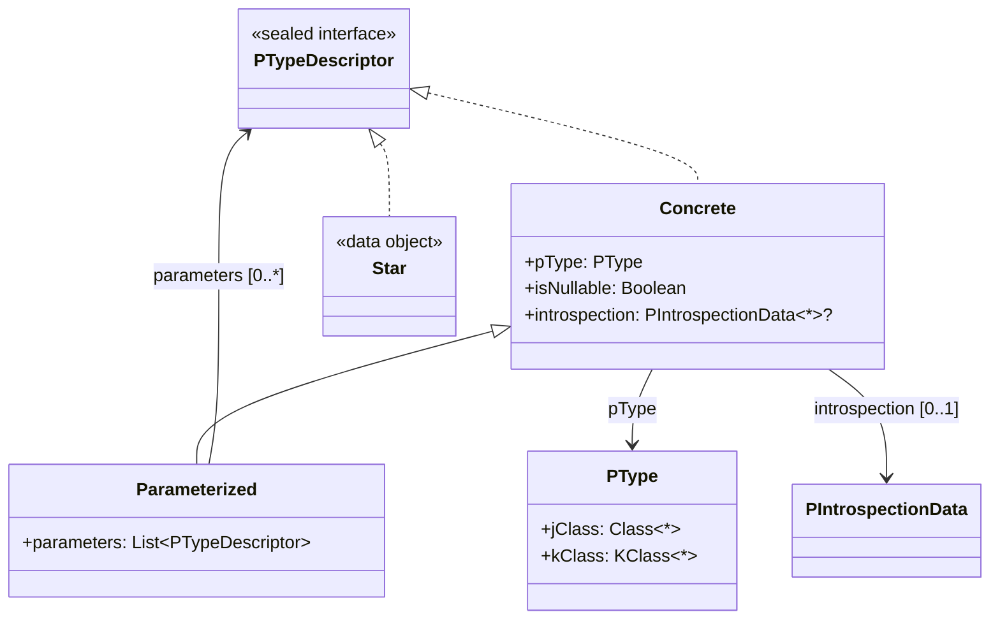
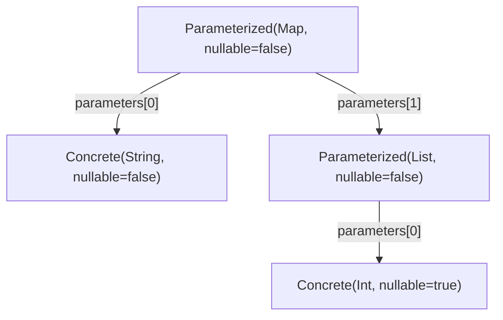
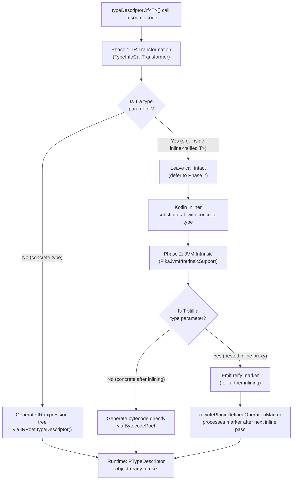
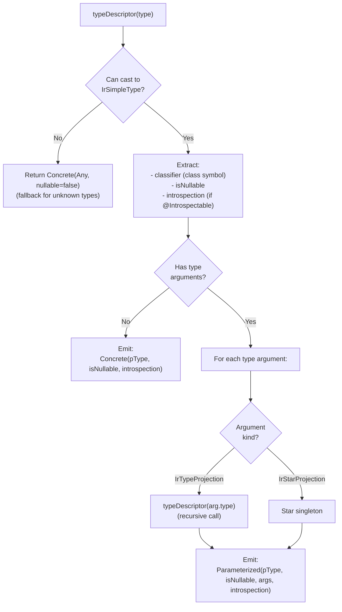
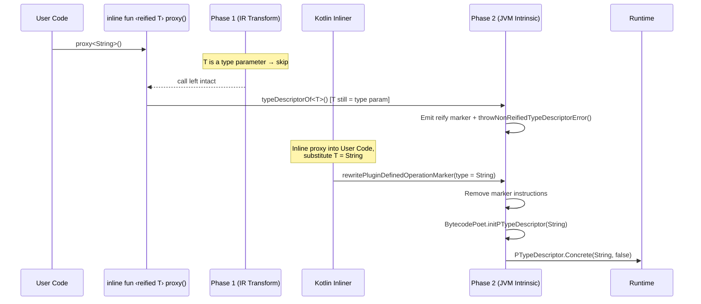

`typeDescriptorOf<T>()` is a **compiler-intrinsic function** that generates a complete type descriptor for `T`
at compile time. The function body never executes -- the Pika compiler plugin intercepts every call and replaces
it with code that constructs a `PTypeDescriptor` object tree, giving you full runtime access to generic type
arguments, nullability, and introspection data with zero reflection overhead.

## The `PTypeDescriptor` Hierarchy

The return type is a sealed interface hierarchy that mirrors the structure of Kotlin types:



| Node | When used | Properties |
|---|---|---|
| `Concrete` | Simple, non-generic types (`String`, `Int`, `MyClass`) | `pType`, `isNullable`, `introspection?` |
| `Concrete.Parameterized` | Generic types (`List<String>`, `Map<K,V>`) | Inherits `Concrete` + `parameters: List<PTypeDescriptor>` |
| `Star` | Star projections (`*`) in generic arguments | Singleton data object, no properties |

---

## Examples

### Simple types

Non-generic, non-nullable types produce a `Concrete` node:

```kotlin
val s = typeDescriptorOf<String>()
// s is PTypeDescriptor.Concrete
// s.pType.jClass == String::class.java
// s.isNullable   == false

val i = typeDescriptorOf<Int>()
// i.pType.jClass == Int::class.java
// i.isNullable   == false

val b = typeDescriptorOf<Boolean>()
// b.pType.jClass == Boolean::class.java
```

### Nullable types

The `isNullable` flag distinguishes `T` from `T?`:

```kotlin
val ni = typeDescriptorOf<Int?>()
// ni.pType.jClass == Int::class.java
// ni.isNullable   == true

val ns = typeDescriptorOf<String?>()
// ns.pType.jClass == String::class.java
// ns.isNullable   == true
```

### Parameterized types

Generic types produce a `Concrete.Parameterized` node with a `parameters` list that mirrors each type argument:

```kotlin
val list = typeDescriptorOf<List<String>>()
// list is PTypeDescriptor.Concrete.Parameterized
// list.pType.jClass    == List::class.java
// list.parameters.size == 1
// list.parameters[0]   is Concrete(String, nullable=false)

val map = typeDescriptorOf<Map<String, Int>>()
// map.parameters.size == 2
// map.parameters[0]   is Concrete(String)
// map.parameters[1]   is Concrete(Int)
```

### Nested generics

Type arguments are resolved **recursively**, so nested generics produce a tree:

```kotlin
val nested = typeDescriptorOf<Map<String, List<Int?>>>()
// nested.parameters[0] is Concrete(String, nullable=false)
// nested.parameters[1] is Parameterized(List, [Concrete(Int, nullable=true)])
```

The resulting descriptor tree:



### Star projections

A `*` in a type argument is represented by the `Star` singleton:

```kotlin
val star = typeDescriptorOf<List<*>>()
// star is PTypeDescriptor.Concrete.Parameterized
// star.parameters.size == 1
// star.parameters[0]   is PTypeDescriptor.Star
```

### Custom classes

User-defined classes work the same as standard library types:

```kotlin
class Person(val name: String)

val p = typeDescriptorOf<Person>()
// p.pType.jClass == Person::class.java
// p.isNullable   == false

val np = typeDescriptorOf<Person?>()
// np.pType.jClass == Person::class.java
// np.isNullable   == true
```

### Introspectable classes

When a class is annotated with `@Introspectable`, its type descriptor automatically carries
introspection metadata in the `introspection` field:

```kotlin
@Introspectable
class Person(val name: String, var age: Int)

class Plain(val x: Int) // not @Introspectable

val pd = typeDescriptorOf<Person>() as PTypeDescriptor.Concrete
pd.introspection          // non-null PIntrospectionData<Person>
pd.introspection!!.jClass // Person::class.java
pd.introspection!!.properties.map { it.name } // ["name", "age"]

val plain = typeDescriptorOf<Plain>() as PTypeDescriptor.Concrete
plain.introspection       // null

val str = typeDescriptorOf<String>() as PTypeDescriptor.Concrete
str.introspection         // null (standard library types are not @Introspectable)
```

Introspection data is also attached to nested types inside parameterized descriptors:

```kotlin
val list = typeDescriptorOf<List<Person>>() as PTypeDescriptor.Concrete.Parameterized
list.introspection  // null (List is not @Introspectable)

val element = list.parameters[0] as PTypeDescriptor.Concrete
element.introspection?.jClass // Person::class.java
```

### Inline reified proxy functions

`typeDescriptorOf<T>()` works through `inline fun <reified T>` call chains.
The plugin rewires the type at each inlined call site:

```kotlin
inline fun <reified T> describe() = typeDescriptorOf<T>()

// At each call site, T is substituted with the concrete type:
describe<String>()       // Concrete(String, nullable=false)
describe<List<Int?>>()   // Parameterized(List, [Concrete(Int, nullable=true)])
```

Nested proxies are also supported:

```kotlin
inline fun <reified T> proxy1() = typeDescriptorOf<T>()
inline fun <reified T> proxy2() = proxy1<T>()

proxy2<String>() // Concrete(String, nullable=false) -- works through two levels of inlining
```

Calling `typeDescriptorOf<T>()` with a **non-reified** type parameter is a compile-time error
caught at runtime:

```kotlin
fun <T> broken() = typeDescriptorOf<T>() // throws IllegalStateException at runtime:
// "typeDescriptorOf<T>() requires a reified type parameter.
//  Use 'inline fun <reified T>' or call typeDescriptorOf<T>() with a concrete type."
```

---

## Compilation Stage Examples

The following examples show how `typeDescriptorOf<T>()` calls transform through each compilation
stage. All excerpts are trimmed from actual compiler output -- test harness code (assertions, control
flow) is stripped to focus on the plugin's transformations.

### Simple type: `typeDescriptorOf<String>()`

**Source:**

```kotlin
val stringInfo = typeDescriptorOf<String>()
```

**FIR** -- the call is preserved as-is. The plugin does not modify it during FIR resolution:

```
lval stringInfo: R|io/github/lukmccall/pika/PTypeDescriptor| =
    R|io/github/lukmccall/pika/typeDescriptorOf|<R|kotlin/String|>()
```

**IR** -- Phase 1 replaces the call with a `CONSTRUCTOR_CALL` tree that constructs a
`PTypeDescriptor.Concrete`:

```
VAR name:stringInfo type:PTypeDescriptor [val]
  CONSTRUCTOR_CALL 'PTypeDescriptor.Concrete.<init>'
    ARG pType: CONSTRUCTOR_CALL 'PType.<init>'
      ARG jClass: CLASS_REFERENCE name:String
    ARG isNullable: CONST Boolean value=false
    ARG introspection: CONST Null value=null
```

**Bytecode** -- Phase 2 emits the JVM instructions that construct the same object:

```
NEW  PTypeDescriptor$Concrete
DUP
  NEW  PType
  DUP
  LDC  String.class
  INVOKESPECIAL PType.<init>(Class)
ICONST_0                               // isNullable = false
ACONST_NULL                            // introspection = null
INVOKESPECIAL PTypeDescriptor$Concrete.<init>(PType, Z, PIntrospectionData)
```

### Nullable type: `typeDescriptorOf<Int?>()`

**Source:**

```kotlin
val nullableIntInfo = typeDescriptorOf<Int?>()
```

**FIR** -- the `?` nullability marker is visible in the type argument:

```
lval nullableIntInfo: R|io/github/lukmccall/pika/PTypeDescriptor| =
    R|io/github/lukmccall/pika/typeDescriptorOf|<R|kotlin/Int?|>()
```

**IR** -- same structure as `String`, but `isNullable` is `true`:

```
VAR name:nullableIntInfo type:PTypeDescriptor [val]
  CONSTRUCTOR_CALL 'PTypeDescriptor.Concrete.<init>'
    ARG pType: CONSTRUCTOR_CALL 'PType.<init>'
      ARG jClass: CLASS_REFERENCE name:Int
    ARG isNullable: CONST Boolean value=true       // ← nullable
    ARG introspection: CONST Null value=null
```

**Bytecode** -- identical to the simple type, except `ICONST_1` for `isNullable = true`:

```
NEW  PTypeDescriptor$Concrete
DUP
  NEW  PType
  DUP
  LDC  Int.class
  INVOKESPECIAL PType.<init>(Class)
ICONST_1                               // isNullable = true  ← only difference
ACONST_NULL
INVOKESPECIAL PTypeDescriptor$Concrete.<init>(PType, Z, PIntrospectionData)
```

### Parameterized type: `typeDescriptorOf<List<String>>()`

**Source:**

```kotlin
val listStringInfo = typeDescriptorOf<List<String>>()
```

**FIR** -- the full generic type argument is preserved, including inner type parameters:

```
lval listStringInfo: R|io/github/lukmccall/pika/PTypeDescriptor| =
    R|io/github/lukmccall/pika/typeDescriptorOf|<R|kotlin/collections/List<kotlin/String>|>()
```

**IR** -- the call is replaced with a `Parameterized` constructor. The `parameters` argument
contains a `listOf(VARARG(...))` with a nested `Concrete` for the `String` type argument:

```
VAR name:listStringInfo type:PTypeDescriptor [val]
  CONSTRUCTOR_CALL 'PTypeDescriptor.Concrete.Parameterized.<init>'
    ARG pType: CONSTRUCTOR_CALL 'PType.<init>'
      ARG jClass: CLASS_REFERENCE name:List
    ARG isNullable: CONST Boolean value=false
    ARG parameters: CALL 'listOf'
      ARG elements: VARARG
        CONSTRUCTOR_CALL 'PTypeDescriptor.Concrete.<init>'       // ← nested descriptor
          ARG pType: CONSTRUCTOR_CALL 'PType.<init>'
            ARG jClass: CLASS_REFERENCE name:String
          ARG isNullable: CONST Boolean value=false
          ARG introspection: CONST Null value=null
    ARG introspection: CONST Null value=null
```

**Bytecode** -- see the [Bytecode Generation](#bytecode-generation-phase-2) section below for the
full JVM instruction sequence for `List<String>`.

### Star projection: `typeDescriptorOf<List<*>>()`

**Source:**

```kotlin
val starInfo = typeDescriptorOf<List<*>>()
```

**FIR** -- the star projection appears as `*` in the type argument:

```
lval starInfo: R|io/github/lukmccall/pika/PTypeDescriptor| =
    R|io/github/lukmccall/pika/typeDescriptorOf|<R|kotlin/collections/List<*>|>()
```

**IR** -- instead of a nested `Concrete`, the `parameters` list contains a `GET_OBJECT` referencing
the `Star` singleton:

```
VAR name:starInfo type:PTypeDescriptor [val]
  CONSTRUCTOR_CALL 'PTypeDescriptor.Concrete.Parameterized.<init>'
    ARG pType: CONSTRUCTOR_CALL 'PType.<init>'
      ARG jClass: CLASS_REFERENCE name:List
    ARG isNullable: CONST Boolean value=false
    ARG parameters: CALL 'listOf'
      ARG elements: VARARG
        GET_OBJECT 'PTypeDescriptor.Star'            // ← Star singleton, not a Concrete
    ARG introspection: CONST Null value=null
```

### Reified proxy: full 3-phase flow

This example shows the complete multi-phase pipeline -- FIR → IR → Inlining → Bytecode.

**Source:**

```kotlin
inline fun <reified T> proxy() = typeDescriptorOf<T>()

val info = proxy<String>()
```

**FIR** -- the `proxy()` body uses `R|T|` (a type parameter), not a concrete type. The call
site uses `<R|kotlin/String|>`:

```
public final inline fun <reified T> proxy(): R|io/github/lukmccall/pika/PTypeDescriptor| {
    ^proxy R|io/github/lukmccall/pika/typeDescriptorOf|<R|T|>()
}

// call site:
lval info: R|io/github/lukmccall/pika/PTypeDescriptor| = R|test/proxy|<R|kotlin/String|>()
```

**IR** -- Phase 1 sees that `T` is still a type parameter inside `proxy()`, so it **skips** the
replacement. The `typeDescriptorOf<T>()` call remains intact:

```
FUN name:proxy returnType:PTypeDescriptor [inline]
  TYPE_PARAMETER name:T reified:true
  BLOCK_BODY
    RETURN
      CALL 'typeDescriptorOf'
        TYPE_ARG T: T of test.proxy        // ← still a type parameter, not resolved
```

**Bytecode** (post-inlining) -- after the Kotlin inliner substitutes `T = String` at the call
site, Phase 2 emits the constructor bytecode directly. The `proxy()` function has been inlined
away:

```
// Inside box(), after inlining proxy<String>():
NEW  PTypeDescriptor$Concrete
DUP
  NEW  PType
  DUP
  LDC  String.class                       // T resolved to String by the inliner
  INVOKESPECIAL PType.<init>(Class)
ICONST_0
ACONST_NULL
INVOKESPECIAL PTypeDescriptor$Concrete.<init>(PType, Z, PIntrospectionData)
```

---

## Compilation Pipeline

The Pika compiler plugin processes `typeDescriptorOf<T>()` calls in **two phases**. This two-phase
design is necessary because Kotlin's IR generation runs _before_ inline functions are inlined.



### Phase 1: IR Transformation

**Class**: `TypeInfoCallTransformer` (implements `IrTransformer`)

During the IR (Intermediate Representation) generation pass, the transformer visits every function call
in the program. When it encounters a call to `typeDescriptorOf<T>()`:

1. **Extracts the type argument** `T` from the call expression.
2. **Checks if `T` is a concrete type** (e.g. `String`, `List<Int>`) or a type parameter (e.g. `T` inside `inline fun <reified T>`).
3. **If concrete**: replaces the entire call with an IR expression that constructs the `PTypeDescriptor`
   object tree, using `IRPoet.typeDescriptor()`.
4. **If type parameter**: skips the call entirely. The call remains as-is in the IR, and Phase 2 handles it
   after the Kotlin inliner substitutes the type parameter with a concrete type.

### Phase 2: JVM Intrinsic

**Class**: `PikaJvmIrIntrinsicSupport` (implements `JvmIrIntrinsicExtension`)

This phase runs during JVM bytecode generation, _after_ inline functions have been inlined. It handles
calls that Phase 1 skipped:

1. **If `T` is now a concrete type** (post-inlining): emits JVM bytecode directly via `BytecodePoet` to
   construct the `PTypeDescriptor` objects using `NEW` and `INVOKESPECIAL` instructions.
2. **If `T` is still a type parameter** (e.g. in a nested `inline fun <reified T>` chain): emits a
   **reify marker** -- a special bytecode sequence that the Kotlin inliner recognizes. On the next inline
   pass, `rewritePluginDefinedOperationMarker` removes the marker and emits the final bytecode.

---

## IR Code Generation Algorithm

`IRPoet.typeDescriptor(type: IrType)` converts an `IrType` into an IR expression tree. The algorithm
is recursive:



Key implementation details:

- **Type resolution**: The type's `classifier` (an `IrClassSymbol`) is used to obtain the `Class<*>` reference
  that becomes `PType.jClass` at runtime.
- **Nullability**: Read directly from `IrSimpleType.isMarkedNullable()`.
- **Introspection attachment**: If the type's class has the `@Introspectable` annotation, the generated code
  includes a call to `__PIntrospectionData()` (a synthetic companion function generated by the plugin) to
  populate the `introspection` field.
- **Recursion**: For parameterized types, each type argument is processed by a recursive call to
  `typeDescriptor()`, producing a tree of arbitrarily nested descriptors.
- **Fallback**: If the type cannot be cast to `IrSimpleType` (e.g., flexible types), the algorithm falls back
  to `Concrete(Any, nullable=false)`.

---

## Bytecode Generation (Phase 2)

When generating bytecode directly (via `BytecodePoet`), the plugin emits JVM instructions that
construct `PTypeDescriptor` objects on the stack. For example, for `List<String>`:

```
NEW  PTypeDescriptor$Concrete$Parameterized
DUP
  NEW  PType
  DUP
  LDC  List.class
  INVOKESPECIAL PType.<init>(Class)
ICONST_0                               // isNullable = false
  ICONST_1                             // array size = 1
  ANEWARRAY PTypeDescriptor
  DUP
  ICONST_0                             // index 0
    NEW  PTypeDescriptor$Concrete
    DUP
      NEW  PType
      DUP
      LDC  String.class
      INVOKESPECIAL PType.<init>(Class)
    ICONST_0                           // isNullable = false
    ACONST_NULL                        // introspection = null
    INVOKESPECIAL PTypeDescriptor$Concrete.<init>(PType, Z, PIntrospectionData)
  AASTORE
  INVOKESTATIC ArraysKt.asList([Object])List
ACONST_NULL                            // introspection = null
INVOKESPECIAL PTypeDescriptor$Concrete$Parameterized.<init>(PType, Z, List, PIntrospectionData)
```

This is equivalent to the following Kotlin code, but emitted as raw bytecode for efficiency:

```kotlin
PTypeDescriptor.Concrete.Parameterized(
    pType = PType(List::class.java),
    isNullable = false,
    parameters = listOf(
        PTypeDescriptor.Concrete(
            pType = PType(String::class.java),
            isNullable = false,
            introspection = null
        )
    ),
    introspection = null
)
```

### Simple type (`String`)

For non-generic types, the bytecode is straightforward -- a single `Concrete` constructor call:

```
NEW  PTypeDescriptor$Concrete
DUP
  NEW  PType
  DUP
  LDC  String.class
  INVOKESPECIAL PType.<init>(Class)
ICONST_0                               // isNullable = false
ACONST_NULL                            // introspection = null
INVOKESPECIAL PTypeDescriptor$Concrete.<init>(PType, Z, PIntrospectionData)
```

### Star projection (`List<*>`)

Star projections use `GETSTATIC` to load the `Star` singleton instead of constructing a new
`Concrete`:

```
NEW  PTypeDescriptor$Concrete$Parameterized
DUP
  NEW  PType
  DUP
  LDC  List.class
  INVOKESPECIAL PType.<init>(Class)
ICONST_0                               // isNullable = false
  ICONST_1                             // array size = 1
  ANEWARRAY PTypeDescriptor
  DUP
  ICONST_0                             // index 0
    GETSTATIC PTypeDescriptor$Star.INSTANCE  // ← Star singleton, no constructor
  AASTORE
  INVOKESTATIC ArraysKt.asList([Object])List
ACONST_NULL                            // introspection = null
INVOKESPECIAL PTypeDescriptor$Concrete$Parameterized.<init>(PType, Z, List, PIntrospectionData)
```

---

## The Reify Marker Mechanism

When `typeDescriptorOf<T>()` is called inside a reified inline function, the type `T` is not yet known.
The plugin uses a **reify marker** -- a special bytecode pattern that the Kotlin inliner understands --
to defer type resolution:



The reify marker consists of three bytecode instructions:

1. **Reified operation marker**: `ReifiedTypeInliner.putReifiedOperationMarkerIfNeeded()` --
   tells the Kotlin inliner "this instruction depends on a type parameter."
2. **Throw call**: `INVOKESTATIC throwNonReifiedTypeDescriptorError()` -- a safety net. If the
   inliner fails to process the marker (e.g., the function was called without inlining), this
   throws `IllegalStateException` with a descriptive message.
3. **Plugin marker string**: An `LDC` instruction with the fully qualified function name
   (`io.github.lukmccall.pika.typeDescriptorOf`) followed by a void magic API call. This lets
   `rewritePluginDefinedOperationMarker` identify which Pika function to generate code for.

When the Kotlin inliner processes the call site, it substitutes the type parameter with the concrete type
and invokes `rewritePluginDefinedOperationMarker`. This method:

1. Calls `removeReifyMarker()` to strip all three marker instructions.
2. Calls `BytecodePoet.initPTypeDescriptor(type)` with the now-concrete type to emit the actual
   constructor bytecode.

---

## Error Handling

| Scenario | Behavior |
|---|---|
| Concrete type (direct call) | Replaced at compile time. Zero-cost at runtime. |
| Reified inline proxy | Replaced after inlining via reify marker mechanism. |
| Non-reified type parameter | Throws `IllegalStateException`: _"typeDescriptorOf\<T\>() requires a reified type parameter."_ |
| Unknown/unsupported type | Falls back to `Concrete(Any, nullable=false)`. |
| Plugin not applied | Throws `NotImplementedError`: _"typeDescriptorOf\<T\>() should be replaced by the compiler plugin."_ |
